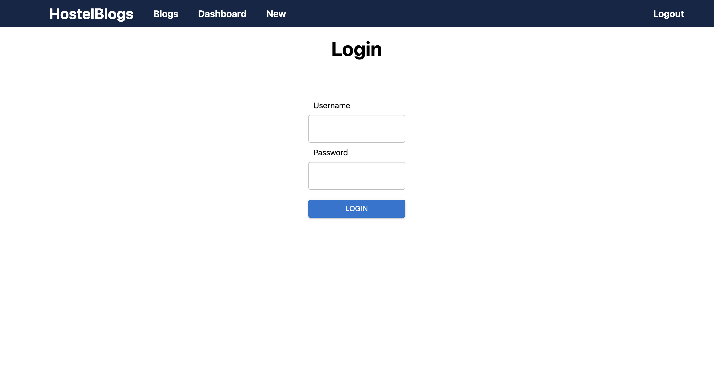
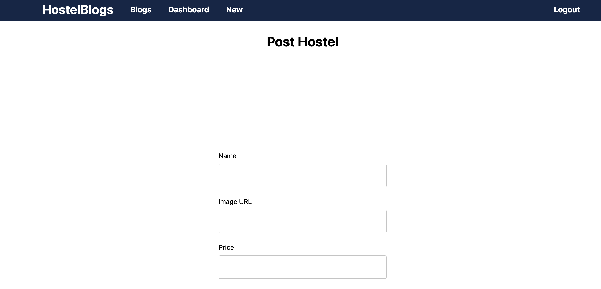

# HostelBlogs

HostelBlogs is a full-stack web application built with Next.js and node.js where users can post information about hostels and view information posted by others. The application features user authentication, CRD operations for hostel listings, and more.

<br>
<br>








## Table of Contents

- [Features](#features)
- [Technologies Used](#technologies-used)
- [Installation](#installation)
- [Environment Variables](#environment-variables)
- [Usage](#usage)
- [API Endpoints](#api-endpoints)
- [License](#license)

## Features

- User authentication (login, logout, register) with security measures.
- Listing and details of each blog.
- JWT based authentication.
- Dashboard for viewing/deleting your blogs
- Protected routes with proper implementation of middleware
- 

## Technologies Used

- Frontend: Next.js, React, SCSS, MUI (Material-UI)
- Backend: Node.js, Express
- Database: MongoDB
- Authentication: JWT

## Installation

### Prerequisites

- Node.js (version 14 or higher)
- MongoDB database

### Backend Steps

1. **Clone the repository:**

    ```bash
    git clone https://github.com/HardikBhati/hostelmania.git
    cd hostelmania_backend
    ```

2. **Install dependencies:**

    ```bash
    npm install
    ```

3. **Set up environment variables:**

    Create a `.env.local` file in the root directory and add the following environment variables:

    ```env
    FRONTEND_ORIGIN=http://localhost:3001
    MONGODB_URI=mongodb://localhost:27017/HostelMania
    JWT_SECRET=your_jwt_secret
    ```
4. **Set up Mongo db:**
    install Mongo db for your system create database HostelMania
5. **Run the development server:**

    ```bash
    npm start
    ```

    Open [http://localhost:3000](http://localhost:3000) with your browser to see the result.


### Frontend Steps

1. **Set ENV variable in .env.local  (for backend endpoint)

    ```bash
    NEXT_PUBLIC_API=http://localhost:3000
    ```
3. **Start the development server:**

    ```bash
    npm run dev
    ```

4. **Open your browser:**

    Navigate to [http://localhost:3001](http://localhost:3001).  # 3000 port will be used by backend

### Building for Production

1. **Build the project:**

    ```bash
    npm run build
    ```

2. **Start the production server:**

    ```bash
    npm start
    ```


## API Endpoints (backend)


- `POST /register`: Register a new user
- `POST /login`: Login a user
- `GET /hostels`: Get all hostel blogs
- `POST /hostels`: Create a new blog (authenticated)
- `GET /hostels/:id`: Get a blog by ID
- `GET /hostels/?userId:<user_id>`: get your blogs (for dashboard)
- `DELETE /hostels/:id`: Delete hostel if authorized
